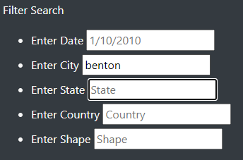

# UFO Sightings with JavaScript

## Overview of the analysis

The purpose of this project is to have a website that houses all of the data from UFO sightings across the world. The data would be neatly presented into a data frame that contains the date, city, state, country, shape, duration and comments of each sighting. The table would also have a filter system that would limit the results based on user input.

## Results

### How Filtering Works

The above image is how the filter box looks like without any input. We have text boxes where we can enter in for the Date, City, State, Country and/or Shape of the UFO sighting.

As a demonstration, let's try a filter by typing in Benton under the city filter.  

After typing it in and clicking out of it. The table immediately shows one sighting in Benton.

We can also have simultaneous filters happening as well. So we can try searching for State and Shape. For example we'll do CA (California) as the state and triangle as the shape.

After clicking off of it, our results will show 7 sightings with those specifc criteria we typed in.

## Summary and Recommendations

The website overall is very functional and provides a great way for us to look for the data we want. However, one drawback that the website has is that it isn't the most user friendly for people who aren't familiar with the data. For instance, we wouldn't be able to type the whole state's name but the initial for it as per our California example we tried earlier.

A recommendation I would consider adding would be having drop down menus to click from along with typing in the text boxes to make searching even more inituitive. This would be similar to data validation in Excel where we want to make sure what we type matches what the data contains.

Another recommendation would be to consider adding a broad search bar and tags to the data as an additional way of identifying them. Similar to searching for things on Google or on Youtube, the tag system would be useful to pull up results that are similar to what was typed and especially account for typos. 

